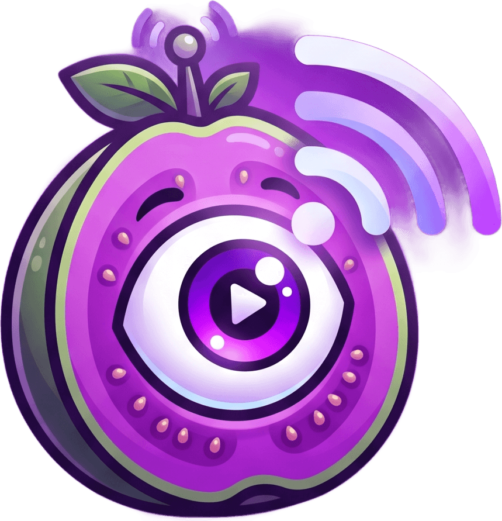

<p align="center">
  
</p>

<h1 align="center">Zói da Goiaba</h1>

<p align="center">
  Compartilhamento de tela P2P para Windows. Sem servidor de mídia, sem custo mensal.
</p>

<p align="center">
  <strong>Status: em desenvolvimento ativo</strong>
</p>

---

> **Em desenvolvimento.** O projeto está em evolução constante: novas
> funcionalidades, mudanças de comportamento e ajustes de interface são
> esperados. Coisas podem quebrar entre versões, e a compatibilidade entre
> versões diferentes do app não é garantida. Mantenha todo mundo da sala na
> mesma versão sempre que possível.

## O que é

Aplicativo desktop para Windows que permite a um grupo de até 8 pessoas
compartilhar a tela, com áudio do sistema opcional, diretamente entre os
computadores, através de uma malha WebRTC ponto a ponto. Não há servidor de
mídia envolvido: o vídeo sai de uma máquina e chega na outra pelo caminho mais
curto disponível. A sinalização usa o servidor público do PeerJS apenas para
que os participantes se encontrem.

Foi desenhado para assistir a filmes e acompanhar partidas em grupo, com
prioridade em qualidade de imagem e baixa latência.

## Por que isso existe

O Discord removeu o compartilhamento de tela no Brasil. Com isso, as sessões de
filme e as noites de jogo do grupo deixaram de ser possíveis: era ali que a
gente assistia junto.

A alternativa seria assinar algum serviço pago. Como o uso era estritamente
recreativo, de fim de semana, pagar mensalidade não se justificava. A decisão
foi construir uma solução própria.

O objetivo é direto: voltar a assistir a filmes e a jogar em grupo com qualidade
igual ou superior à que existia antes, sem custo recorrente e sem depender da
decisão de uma empresa sobre manter ou não um recurso disponível.

## Como funciona (a ideia)

Não existe servidor de mídia em nenhum ponto do caminho. Durante uma
transmissão, os computadores se conectam **diretamente** entre si, em uma malha
WebRTC ponto a ponto, e o vídeo trafega da máquina de origem para a de destino
sem intermediários.

Para que dois computadores se localizem na internet, é preciso um serviço de
sinalização. Esse é o papel do servidor público e gratuito do PeerJS: ele
funciona como uma lista telefônica, faz a apresentação inicial entre os pares e
sai do caminho. Estabelecida a conexão, ele não participa do tráfego de vídeo
nem tem acesso a ele.

O estado da sala (participantes, dono e banidos) também não depende de servidor:
vive no aplicativo de cada participante, com o dono da sala atuando como
autoridade. A sala existe enquanto houver alguém nela e deixa de existir depois
disso. É por esse desenho que não há cadastro, não há custo e não há uma empresa
intermediando a conexão.

Prioridades de projeto, nesta ordem:

1. **Performance e qualidade de imagem.** O app existe para assistir a vídeo em
   grupo, então perda de nitidez ou travamento comprometem o propósito inteiro.
2. **Interface cuidada.** Tema escuro com identidade roxa, animações discretas e
   navegação enxuta, sem sacrificar o item anterior.

## Funcionalidades

- Salas com código, aleatório ou personalizado, e limite configurável de 2 a 8 pessoas
- Várias transmissões simultâneas, com escolha individual de qual assistir
- Áudio do sistema opcional junto com a tela
- Presets de qualidade 720p30, 1080p30 e 1080p60, com adaptação automática
- Modo tela cheia real, com controles que se ocultam automaticamente
- Picture-in-picture
- Controle de volume local por espectador
- Moderação pelo dono da sala (desconectar e banir), com transferência automática em caso de queda
- Reconexão automática, com janela de tolerância de 15 segundos
- Sons de notificação próprios, gravados na boca pelo próprio criador, e saudações variadas na abertura
- Atualização automática via GitHub Releases

## Instalação

1. Baixe o `ZoiDaGoiaba-Setup.exe` na página de
   [Releases](https://github.com/Pontinn/zoi-da-goiaba/releases).
2. Execute o instalador e siga o assistente.
3. O aviso do SmartScreen ("O Windows protegeu o computador") é esperado, pois o
   executável não possui assinatura digital. Clique em **Mais informações** e
   depois em **Executar assim mesmo**.

Requer Windows 10 ou 11.

## Como usar

1. Crie uma sala e copie o código gerado.
2. Envie o código para o grupo.
3. Cada participante entra com o código, e qualquer um pode iniciar uma
   transmissão a qualquer momento.

## Uso e finalidade

Este projeto **não** foi feito para ser comercializado. É um projeto pessoal,
desenvolvido para uso de um grupo de amigos, e permanece com esse escopo.

O código é público por dois motivos práticos: transparência, já que se trata de
um executável sem assinatura digital e é razoável poder inspecionar o que ele
faz, e viabilidade da atualização automática, que depende do GitHub Releases.
Isso não o torna um produto: não há suporte, não há garantias e não há
compromisso de manutenção ou de prazos.

O uso pessoal e entre amigos é permitido. Uso comercial, redistribuição e
trabalhos derivados exigem autorização expressa do autor. Os termos completos
estão em [LICENSE](LICENSE).

## Desenvolvimento

Requisitos: Node 22.12+ e Windows (a captura de tela e o loopback de áudio
dependem de APIs do Windows).

```bash
npm install         # instala as dependências
npm run dev         # sobe o app em modo desenvolvimento
npm test            # testes unitários
npm run test:e2e    # testes end to end
npm run dist        # gera o instalador em release/
```

Documentação detalhada em [docs/DESENVOLVIMENTO.md](docs/DESENVOLVIMENTO.md).

## Arquitetura em uma frase

Electron com malha WebRTC de até 8 peers, estado da sala distribuído entre os
clientes via DataChannel (o dono da sala é a autoridade), PeerJS público apenas
para sinalização e nenhum backend próprio.

---

<sub>Projeto pessoal de um grupo de amigos, fornecido sem garantias. Use por sua
conta e risco. Quanto ao nome (e aos sons): é piada interna, e vai continuar assim.</sub>
